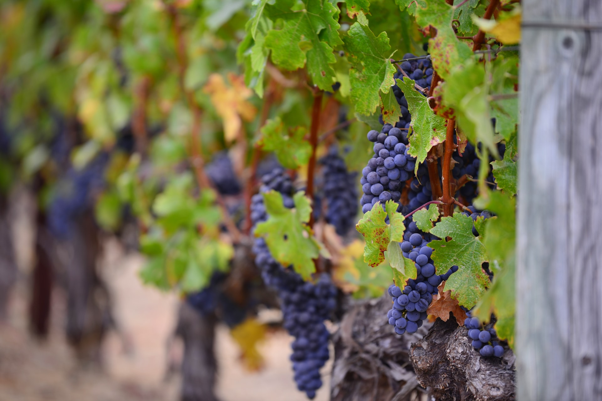
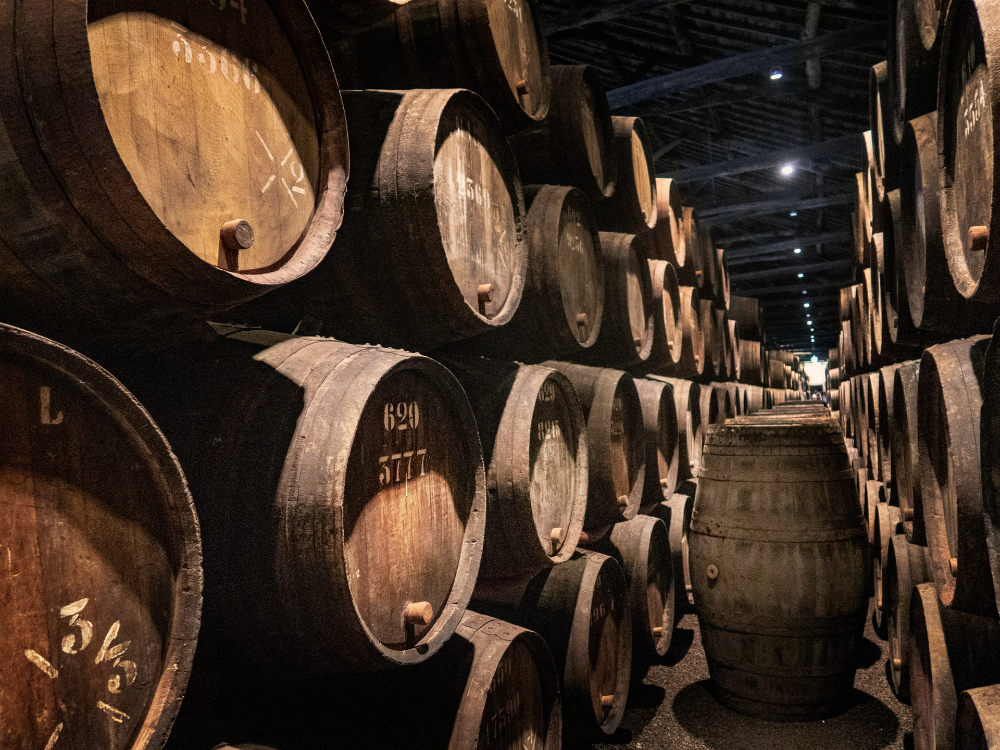
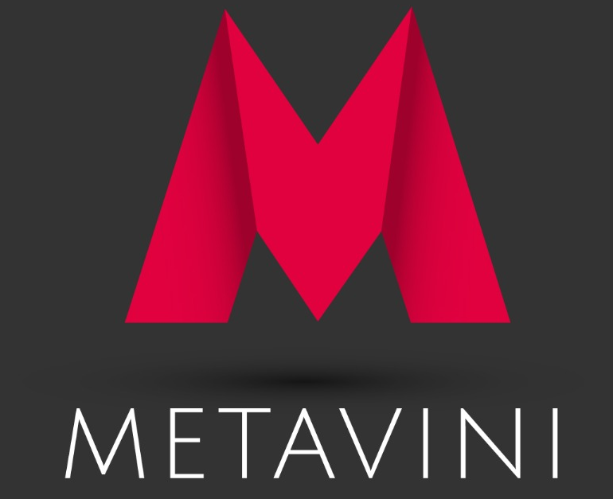

Some of my fondest childhood memories are from the times when I’d accompany my father to wine producers. Twice every year, we’d visit producers in the Mirandela region, my homeland, and purchase wine.                 

At the time, I was too young to realize the added value of buying a product at the origin and the business that was taking place. What I remembered was the experience.      

The older guys pouring and tasting wine directly from kites, like wine scientists, and the joyful discussion and celebration of the qualities of that year’s harvest which usually ensued.             

The beautiful wineries and farms I’d visit and which I was keen to explore, regardless of my father’s warnings to “stay close”.           

<!--truncate-->

Exploring and playing in what seemed infinite stretches of land, feeling the aroma of the vine.           

The 5L bottles of wine we’d fill and bring back home. Buying cork stoppers and setting aside the bottles we were supposed to bring back the next time around.             

These were good times, and I wasn’t even old enough to taste the wine!   

A couple of decades later, the industry has evolved dramatically. Most production has been industrialized, as has manufacturing, bottling and distribution.            

The same wine my father and I would buy from a small producer in Mirandela can now be shipped and exported to the other side of the world, with very little need for human intervention.            

Most recently, the disruption in global trade and supply chains had brought costs and complexity up.                        

In 2017, I started my journey with crypto, blockchain and “web3”. In the first few months, I was trading crypto and making (and losing) money with all the ups and downs, as many of us did.            

I started studying and learning more about it, investing my time in courses, workshops, events. Soon, I realized the potential this technology had for many other use cases and industries, much beyond crypto.                        

After being invited by friends and partners to collaborate in a couple of projects leveraging on blockchain, I began to feel the need to create something of mine.               

In September 2020, after a workshop with a blockchain expert, I learned about NFTs and got my first CryptoKitty. This was around the time the NFT hype really took off.   

The uniqueness of my CryptoKitty and NFT, though, felt too little. Surely, NFTs could be used for more than just cute digital cats, or monkeys or all the stuff people were investing in at the time.                      

Metavini was born at precisely 3:29AM on a beautiful night, after sharing some bottles of wine and some hours of joyful discussion and celebration of the qualities of what we’d just tasted, just like my father and his friends used to do.     

It hit me that wine was a much better asset to tie to an NFT than most others I’d known so far.          

I didn’t sleep that night.    

With my brain exploding with ideas, I went to the office and started sketching the cornerstones of what would become Metavini: everyone in the wine industry across the world would gain from a decentralized ecosystem in which wine would be traded and valued through its uniqueness.          

Consumers and collectors anywhere could have access to buying or even pre-ordering premium wine products which, under normal circumstances, would only be accessible by few.       

It would be possible to collect wine without the need to gather it all at home - we could source the storage! And when the buyer decides to enjoy its wine? Just burn the NFT and have it delivered!         

Producers could position their products in new markets, inaccessible until today. Wine products could be sold even before the harvest. Wine experiences could be promoted by producers in a peer-to-peer, face-to-face manner.           

They could also augment their promotion and sales capabilities and their experiences using the Metaverse.         

Had I just conceived on a new way of owning, trading and experiencing wine? Or was this just wishful thinking?         

To test the concept, I spend the next months talking to wine producers and collectors in my network, and improving the concept and our pitch.        

After dozens of conversations, it became clear Metavini was not just wanted - it was needed.             

The project was praised unanimously as it bridged the traditional wine industry with the new worlds of web3 and the Metaverse.          

And so… here we are. **Welcome to METAVINI**. Now you know the story that brought us here.     

I invite you to stick around and be part of what’s coming!         

Yours Truly,          

Octávio Pinto,               
Founder CEO of Metavini         

