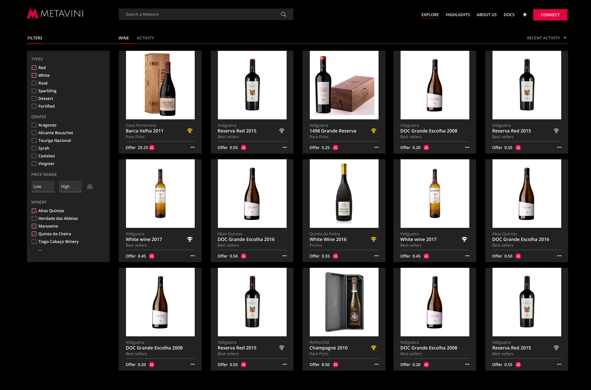
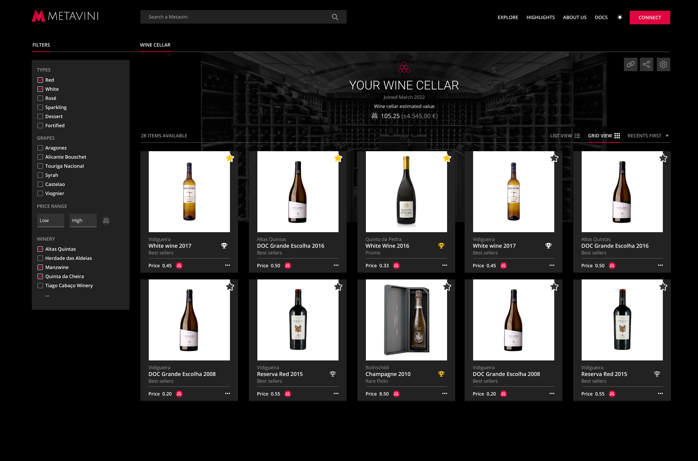

# Main Features

## Trade - NFT Marketplace

Easily trade NFTs - the proof of ownership of a physical wine asset - using our NFT Marketplace.

Buy, sell or auction your NFTS knowing that your wine will be stored in perfect conditions at one of our storage facilities, no matter the result.

## Collect - Digital Wine Cellar

NFTs that you acquire are stored in your Wallet, which is Web3's equivalent to a secure digital vault that only you control.

At Metavini, your Wallet is also your decentralized digital wine cellar.

Collect and manage your digital cellar in style, follow how value increases while the wine is aging, or simply share it with your friends, show them your latest acquisitions and decide what you'll be doing next: trading or enjoying?

## Enjoy - Get it Delivered

At any time, the NFT owner may choose to enjoy its wine. By burning their NFT, owners also trigger Metavini to safely and securely pick-up, transport and deliver the wine in hand, across a growing number of physical locations.

That's one small step for man, one giant leap for the wine experience.
